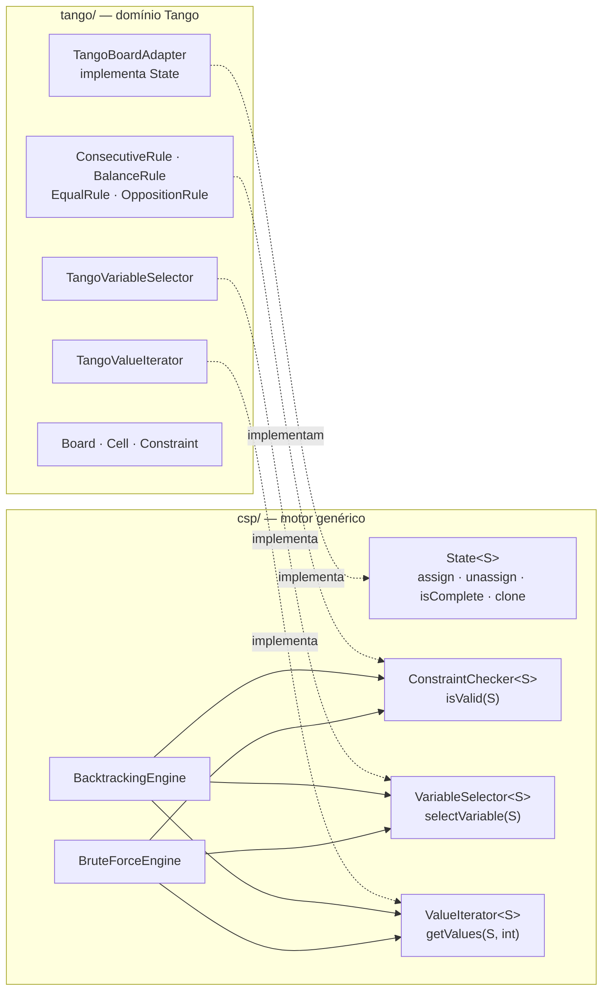

# Tango Puzzle Solver

> Resolução do quebra-cabeça **Tango** como um Problema de Satisfação de Restrições (CSP), comparando **Força Bruta** e **Backtracking** — do espaço de busca teórico à poda que o torna tratável.


**TP2 — Fundamentos de Projeto e Análise de Algoritmos · PUC Minas 2026/1**
**Autores:** Bernardo Alvim, Gabriela Alvarenga, Marcos Alberto, Mateus Araujo, Pedro Seabra

---

## Sumário

- [Sobre o projeto](#sobre-o-projeto)
- [Regras do Tango](#regras-do-tango)
- [Arquitetura](#arquitetura)
- [Algoritmos](#algoritmos)
- [Resultados](#resultados)
- [Análise de complexidade](#análise-de-complexidade)
- [Pré-requisitos](#pré-requisitos)
- [Compilar](#compilar)
- [Rodar](#rodar)
- [Estrutura do projeto](#estrutura-do-projeto)
- [Saída esperada](#saída-esperada)
- [Artigo científico](#artigo-científico)

---

## Sobre o projeto

O **Tango** é jogado em uma grade N×N (N par) onde cada célula deve receber um de dois símbolos, Sol (☀) ou Lua (☽), sob cinco regras que restringem adjacência, equilíbrio por linha/coluna e pares de células conectadas por `=` ou `×`. Todo tabuleiro bem formulado tem **exatamente uma solução**.

Este projeto modela o Tango como um CSP — tripla `(X, D, C)` de variáveis, domínios e restrições — e implementa duas estratégias de busca para resolvê-lo:

- **Força Bruta**: gera todas as `2^k` combinações possíveis para as `k` células vazias e só verifica as regras no tabuleiro completo.
- **Backtracking**: verifica as regras a cada atribuição individual, podando subárvores inteiras assim que uma violação é detectada.

A implementação segue uma **arquitetura de duas camadas**: um motor de busca genérico (`csp/`), que não conhece nada sobre Sol, Lua ou tabuleiro, e a lógica específica do domínio Tango (`tango/`), que implementa os contratos do motor. Essa separação permite trocar o algoritmo de busca — de Backtracking para Força Bruta e vice-versa — sem tocar em nenhuma regra de validação.

---

## Regras do Tango

1. **Preenchimento completo** — toda célula recebe Sol (☀) ou Lua (☽)
2. **Limite de adjacência** — máximo 2 símbolos iguais consecutivos em linha ou coluna
3. **Equilíbrio** — cada linha e coluna tem exatamente N/2 Sóis e N/2 Luas
4. **Restrição `=`** — células conectadas por `=` devem ter o mesmo símbolo
5. **Restrição `×`** — células conectadas por `×` devem ter símbolos opostos

---

## Arquitetura



O motor `csp/` não importa nada relacionado ao Tango. A camada `tango/` traduz operações genéricas em operações concretas sobre o `Board`: cada célula é indexada linearmente (`i = linha × N + coluna`), permitindo acesso em O(1).

| Regra | Estratégia de poda |
|---|---|
| `ConsecutiveRule` | Conta símbolos idênticos consecutivos por linha/coluna; zera ao encontrar célula vazia |
| `BalanceRule` | Rejeita estados onde o equilíbrio N/2 já é matematicamente impossível, mesmo antes de a linha/coluna estar cheia |
| `EqualRule` / `OppositionRule` | Avaliam cada restrição só quando ambas as células envolvidas já foram preenchidas |

---

## Algoritmos

| | Força Bruta | Backtracking |
|---|---|---|
| Quando verifica restrições | Só no tabuleiro completo (folhas da árvore) | A cada atribuição individual |
| Complexidade (pior caso) | `O(2^k · N²)` | Exponencial, mas com poda agressiva na prática |
| Poda | Nenhuma | Elimina `2^j` estados de uma vez ao detectar violação com `j` células restantes |
| Viabilidade | Só até ~6×6 | Escala até 16×16 e além |

```java
// BacktrackingEngine — verifica a cada atribuição
if (checker.isValid(state)) {
    backtrack(state);
    if (firstSolution != null) return;
} else {
    backtracks++;   // poda: subárvore inteira descartada
}
state.unassign(variable);
```

---

## Resultados

Benchmarks executados em Apple M5 (10 núcleos) · 16 GB RAM · OpenJDK 21, sem flags de tuning. Detalhes completos no [artigo científico](#artigo-científico).

| Tabuleiro | Alg. | Tempo | Nós visitados | Verificações | Podas |
|---|---|---:|---:|---:|---:|
| 4×4 | BT | 1,90 ms | 15 | 23 | 9 |
| 4×4 | FB | 3,92 ms | 7.772 | 3.884 | 0 |
| 6×6 fácil | BT | 146 µs | 32 | 48 | 17 |
| 6×6 fácil | FB | 9,76 s | 514.505.331 | 257.252.659 | 0 |
| 6×6 médio | BT | 204 µs | 37 | 58 | 22 |
| 6×6 médio | FB | 16,83 s | 785.176.951 | 392.588.469 | 0 |
| 6×6 difícil | BT | 112 µs | 47 | 78 | 32 |
| 6×6 difícil | FB | 122,40 s | 5.686.273.731 | 2.843.136.859 | 0 |
| 8×8 | BT | 383 µs | 183 | 338 | 156 |
| 8×8 | FB | — | inviável (`2^49` estados) | — | — |
| 16×16 | BT | 335,81 ms | 206.771 | 413.428 | 206.658 |
| 16×16 | FB | — | inviável (`2^224` estados) | — | — |

Para o 6×6 difícil, o Backtracking precisou de **78 verificações contra 2,8 bilhões** da Força Bruta — uma razão de **36.450.473×** — resolvendo em 112 µs contra 122,4 s. No 16×16, a taxa de poda foi de **99,94%**.

---

## Análise de complexidade

O espaço de busca é determinado pelo número de células vazias `k`: existem `2^k` atribuições completas possíveis, e cada avaliação custa `O(N²)` (percorre linhas, colunas e restrições).

| Tamanho | Células vazias (k) | Espaço (`2^k`) | Força Bruta viável? |
|---|---:|---|---|
| 4×4 | 13 | ≈ 8.000 | Sim (milissegundos) |
| 6×6 | 30–32 | ≈ 10⁹ a 4×10⁹ | Marginalmente (segundos a minutos) |
| 8×8 | 49 | ≈ 5,6×10¹⁴ | Não (estimativa: anos) |
| 16×16 | 224 | ≫ 10⁶⁷ | Impossível |

O Backtracking mantém complexidade exponencial de pior caso, mas as cinco regras do Tango são restritivas o bastante sobre estados *parciais* para que a poda elimine subárvores exponenciais antes de precisarem ser geradas — daí a tratabilidade prática até 16×16.

---

## Pré-requisitos

| Ferramenta | Versão mínima |
|---|---|
| Java (JDK) | 17 |
| Maven | 3.6 |

---

## Compilar

```bash
cd code
mvn package -DskipTests
```

---

## Rodar

> Os comandos abaixo devem ser executados a partir do diretório `code/`.

### Executar todos os tabuleiros (BT + BF)

```bash
java -cp target/classes tp2.fpaa.Main
```

### Escolher o algoritmo para todos os tabuleiros

```bash
java -cp target/classes tp2.fpaa.Main bt    # só Backtracking
java -cp target/classes tp2.fpaa.Main bf    # só Força Bruta
java -cp target/classes tp2.fpaa.Main both  # ambos (padrão)
```

### Executar um tabuleiro específico

```bash
java -cp target/classes tp2.fpaa.Main <tabuleiro> <algoritmo>
```

**Tabuleiros disponíveis:**

| Nome | Atalho | Tamanho | Dificuldade |
|---|---|---|---|
| `4x4` | `4x4` | 4×4 | — |
| `6x6-easy` | `easy` | 6×6 | Fácil |
| `6x6-medium` | `medium` | 6×6 | Médio |
| `6x6-hard` | `hard` | 6×6 | Difícil |
| `8x8` | `8x8` | 8×8 | — |
| `16x16` | `16x16` | 16×16 | — |

**Algoritmos:** `bt` (Backtracking) · `bf` (Força Bruta) · `both` (ambos)

**Exemplos:**

```bash
# 4×4 com ambos os algoritmos
java -cp target/classes tp2.fpaa.Main 4x4 both

# 6×6 difícil só com Backtracking
java -cp target/classes tp2.fpaa.Main hard bt

# 16×16 (Força Bruta é ignorada automaticamente)
java -cp target/classes tp2.fpaa.Main 16x16 bt
```

> Tabuleiros maiores que 6×6 ignoram automaticamente a Força Bruta e exibem um aviso com o tamanho do espaço de busca.

---

## Estrutura do projeto

```
code/
├── pom.xml
└── src/main/
    ├── java/tp2/fpaa/
    │   ├── csp/                        ← Motor genérico de busca (independente do Tango)
    │   │   ├── contract/               ← State, ConstraintChecker, VariableSelector, ValueIterator
    │   │   ├── engine/                 ← BacktrackingEngine, BruteForceEngine
    │   │   └── result/                 ← SolveResult
    │   ├── tango/                      ← Lógica específica do quebra-cabeça
    │   │   ├── domain/                 ← Symbol, ConstraintType, Constraint
    │   │   ├── board/                  ← Cell, Board, BoardFactory
    │   │   ├── validation/             ← Rule, BalanceRule, ConsecutiveRule, EqualRule,
    │   │   │                               OppositionRule, TangoConstraintChecker
    │   │   ├── heuristic/              ← TangoVariableSelector, TangoValueIterator
    │   │   ├── adapter/                ← TangoBoardAdapter (ponte entre as duas camadas)
    │   │   └── io/                     ← BoardParser, BoardPrinter, ResultPrinter, RunResult
    │   └── Main.java
    └── resources/                      ← board_4x4.txt, board_6x6_easy.txt, board_6x6_medium.txt,
                                            board_6x6_hard.txt, board_8x8.txt, board_16x16.txt
```

---

## Saída esperada

```
╔═════════════════════════════╗
║  ☀  TANGO PUZZLE SOLVER  ☽  ║
╚═════════════════════════════╝

  Executando todos os boards...

┌─ Board: 4x4 ───────────────────────────────┐

══ Backtracking ════════════════════

─── Solução ──────────────────────────────
  ┌───┬───┬───┬───┐
  │ ☀ = ☀ × ☽ = ☽ │
  ├─×─┼───┼───┼───┤
  │ ☽ = ☽ × ☀ = ☀ │
  ├───┼───┼───┼───┤
  │ ☽ │ ☀ = ☀ │ ☽ │
  ├───┼───┼───┼───┤
  │ ☀ │ ☽ │ ☽ │ ☀ │
  └───┴───┴───┴───┘

  ✓ Solução encontrada!
    Tempo                    : 1,90 ms
    Nós visitados            : 15
    Verificações de restrição: 23
    Podas (restrição violada): 9
```

---

## Artigo científico

O relatório completo — fundamentação teórica, modelagem formal, detalhamento das quatro regras de poda e análise comparativa integral — está disponível em [`TP2___FPAA___Backtracking___Bruteforce_no_Tango.pdf`](TP2___FPAA___Backtracking___Bruteforce_no_Tango.pdf).

---

<div align="center">
  
</div>
<p align="center">Fonte do banner: <a href="https://github.com/joaopauloaramuni">João Paulo Carneiro Aramuni</a></p>

---
